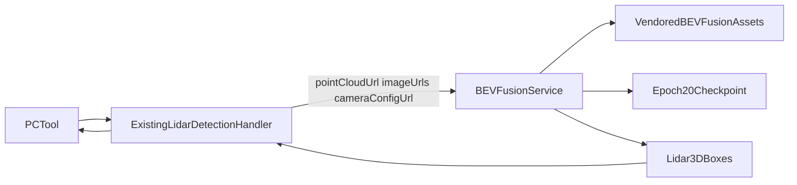

# BEVFusion LiDAR-Camera 3-Class Detection 设计

## 背景与目标

替换 Xtreme 中未完成且标记为 LiDAR-only 的 `BEVFusion LiDAR 3-Class Detection` 部署骨架，改用 `/PnP/lxzhu/mmdetection3d/work_dirs/bevfusion_lidar_cam_custom_nus_3class_v2/epoch_20.pth`。

该模型融合 4 路鱼眼图像和 5 通道点云，直接输出 LiDAR 局部坐标系的三维框。模型运行时不得依赖或挂载 `/PnP/lxzhu/mmdetection3d`。

## 范围和约束

- 保留现有模型名称、模型 ID、`LIDAR_DETECTION` 路由和类别代码：`car`、`cone`、`pillar`。
- 仅支持具备同一帧点云、4 路图像和 `camera_config` 的 Fusion 数据。
- `epoch_20.pth`、配套解析后的 config、`car.json`、BEVFusion Python 代码和 CUDA 扩展均在 Xtreme 的部署目录或构建镜像中提供。
- 生产运行时不使用 `/PnP/lxzhu/mmdetection3d` 目录、宿主机 Python 环境或外部代码挂载。
- 模型输出直接采用现有 Xtreme 点云检测响应中的 `x/y/z/dx/dy/dz/rotX/rotY/rotZ`，不进行图像关键点 lift 或跨视图框合并。

## 模型事实

- 模型为 LiDAR+Camera BEVFusion，不是纯 LiDAR 模型。
- 点云输入是 `(x, y, z, intensity, timestamp)` 5 通道；模型空间范围为 `[-21,-21,-5,21,21,4]`。
- 图像输入固定为 `CAM_FRONT`、`CAM_LEFT`、`CAM_BACK`、`CAM_RIGHT` 四路鱼眼相机，并经 `256x704` 图像预处理。
- 输出是 LiDAR 坐标系 3D box，检测类别为 Car、Cone、Pillar。
- 训练环境为 Python 3.10、PyTorch 2.1/CUDA 11.8、MMEngine 0.10.5、mmdet3d 1.4.0 和 BEVFusion CUDA ops。

## 方案选择

采用自包含的 GPU Docker 服务，而非 ONNX：

1. 将最少必需的 mmdet3d 与 `projects/BEVFusion` 源码 vendor 到 `deploy/point-cloud-bevfusion-detection/vendor/`。
2. 在 Docker build 阶段安装匹配的 PyTorch/MM 系列依赖并编译 `bev_pool` 和 hard voxelization CUDA 扩展。
3. 将 checkpoint、配置与自车盲区配置文件复制或挂载至部署目录。
4. 用新的 `detection_service.py` 将 Xtreme 任务请求转换为 BEVFusion 多模态推理输入。

不使用现有 LiDAR-only 方式，因为其 config 与 `epoch_20.pth` 的 camera branch、DepthLSS 和 fusion layer 不兼容。

## 架构与数据流



## 服务接口

保留现有 HTTP 接口：

`POST /pointCloud/recognition`

请求中的每个 `datas` 项必须包含：

- `id`
- `pointCloudUrl`
- 4 个有稳定相机索引的 `imageUrls`
- `cameraConfigUrl`

服务下载点云、图像和标定后，按照 `camera_image_0...3` 对应的标定索引绑定四个 BEVFusion 视图。若缺少一个视图、标定不完整、点云不是可转换为 5 通道的格式，当前项返回 `ERROR`，不会以不完整的相机输入执行融合模型。

成功响应保持：

```json
{
  "code": "OK",
  "message": "",
  "data": [
    {
      "id": 1,
      "code": "OK",
      "message": "",
      "objects": [
        {
          "label": "car",
          "confidence": 0.91,
          "x": 1.2,
          "y": -3.4,
          "z": 0.5,
          "dx": 4.5,
          "dy": 1.8,
          "dz": 1.6,
          "rotX": 0.0,
          "rotY": 0.0,
          "rotZ": 1.57
        }
      ]
    }
  ]
}
```

## 输入适配

Xtreme 的 `camera_config` 使用每相机的 `cameraInternal`、`cameraExternal`、`cameraModel` 和可选鱼眼 `distortion`。服务将其转换为 BEVFusion 所需的 `cam2img`、`lidar2cam` 和多视图图像元数据。

点云解析保留或补齐第五个 timestamp 通道；没有历史 sweeps 时使用模型配置的 `pad_empty_sweeps=True` 语义重复当前帧。服务应用训练时的自车盲区过滤、相机图像预处理和点云范围过滤。

## 部署

`point-cloud-bevfusion-detection` 会加入主 `docker-compose.yml` 的 `model` profile，使用 NVIDIA GPU、内部端口 `5000` 和宿主机端口 `8298`。

Dockerfile 不再设置 `/mmdetection3d` 外部挂载或在启动时 editable-install 外部项目；所有依赖安装和 CUDA 扩展编译移到镜像 build 阶段。模型服务启动时只从镜像内或明确挂载的 Xtreme 模型资产加载。

现有 V14/V15 迁移保留模型和类别注册，但通过新 migration 将描述从 LiDAR-only 修正为 LiDAR+4-camera fusion。

## 验证

1. 服务单元测试覆盖四视图排序、Xtreme 标定转换、5 通道点云转换、缺失输入拒绝和 Xtreme 响应格式。
2. 使用固定 Fusion 帧运行 GPU smoke test，确认加载 `epoch_20.pth` 后返回非空 LiDAR 3D box 或可诊断的空检测结果。
3. 将返回的 box 投到 pc-tool，确认中心、尺寸与旋转字段能显示为 3D 标注。
4. 通过 `docker compose --profile model up -d point-cloud-bevfusion-detection` 启动，验证 health、后端连通性、模型管理页面和单帧/场景推理调用。

## 限制

- 任意 Fusion 帧缺少四路图像或静态相机标定时不能使用该模型。
- 单帧缺少历史 sweeps 时可运行，但与训练时多 sweep 输入分布不同，可能降低精度。
- 该自包含镜像包含 CUDA、稀疏卷积、BEVFusion 代码和约 460MB checkpoint，首次构建耗时长且镜像体积较大。
