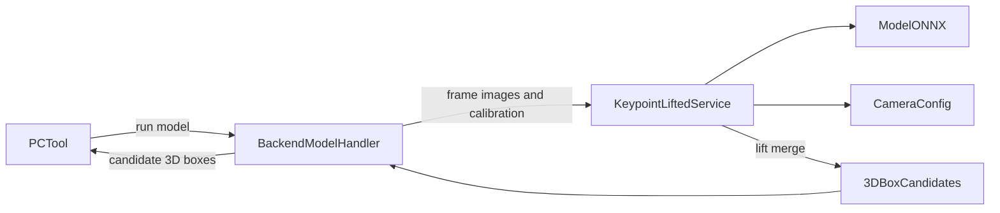

# Keypoint-Lifted Box Detection 设计

## 背景与目标

在 Fusion 数据集中新增 `Keypoint-Lifted Box Detection (mod + keypoints)` 模型。模型对每个相机图像检测目标，输出四个落在地面上的关键点；服务利用 Xtreme 场景中的相机内外参将关键点还原到 LiDAR 局部坐标系，按类别高度生成三维框，并合并两个相机的重复结果。

模型权重为 `/PnP/lxzhu/parkinglotperception2/CenterNet/exp/a100_release_m57_00_finetune/model_last.pth`。最终生产推理使用由该权重导出的 ONNX；部署和运行时不得依赖 `/PnP/lxzhu/parkinglotperception2/CenterNet/` 下的代码或文件。

## 范围和假设

- 仅支持具有 `camera_config`、`camera_image_0...N` 和 `lidar_point_cloud` 的 Fusion 数据。
- 同一帧的图像和点云通过同名 basename 对齐。
- 四个模型关键点均是目标底面与地面的接触点。
- LiDAR 局部坐标系的地面平面为 `z = 0`。
- 双视角相同类别的候选框按鸟瞰 IoU 判重，保留模型置信度较高的一项。
- 高度使用可部署覆盖的类别先验配置；首版提供通用停车场默认值。
- 首版接入 CenterNet 的 15 个 quad 类别；6 个 polyline 类别不生成 3D box。

## 方案选择

采用独立的 `image-keypoint-lifted-detection` Python 服务：

1. 在该服务中迁入最小 PyTorch 参考推理实现，仅用于加载 `model_last.pth` 和导出 ONNX。
2. 使用固定的 Fusion 图片样本将 PyTorch 与 ONNX 的类别、四关键点和置信度进行比对。
3. 服务生产路径仅通过 ONNX Runtime 执行推理、几何还原与双视角融合。

不采用现有 ONNX 文件，因为无法证明它由指定的 `model_last.pth` 导出，且其输入尺寸与解码过程和 PyTorch 路径不一致。

## 架构与数据流

### 后端任务请求

新增独立模型代码 `IMAGE_KEYPOINT_LIFTED_DETECTION` 与 Handler。Handler 从 Fusion `DataInfo.content` 解析：

- 每个相机的图像 URL、尺寸和 `viewIndex`；
- Scene 级 `camera_config` JSON；
- 当前 `dataId` 和点云帧名称。

它将上述内容发送给模型服务，避免沿用只接受单图 URL 的 `IMAGE_DETECTION` 契约。

### 模型服务

服务目录为 `deploy/image-keypoint-lifted-detection/`，包含：

- 从 `model_last.pth` 导出得到的 ONNX 权重；
- 15 个 quad 类别标签；
- 推理预处理、CenterNet quad 解码和关键点置信度过滤；
- 像素关键点到 LiDAR 地面平面的反投影；
- 3D box 构造和跨相机融合；
- FastAPI HTTP 接口、Dockerfile 与依赖清单。

运行时请求的相机参数使用 Xtreme `camera_config` 中的 `cameraInternal`、`cameraExternal`、相机模型及畸变参数。针孔和鱼眼相机都必须按现有 `pc-tool` 的参数语义处理。

### 2D 到 3D

对每个图像关键点 `(u, v)`：

1. 根据相机模型去畸变并得到相机坐标系射线；
2. 使用 `cameraExternal` 的逆变换得到 LiDAR 坐标系射线；
3. 与 `z = 0` 地面平面求交，得到目标底面四角；
4. 由四角中心、边长和朝向构造 LiDAR 局部坐标系的 `3D_BOX`；
5. 从类别高度表读取高度，框底面保持在 `z = 0`。

无法与地面平面产生有限正向交点、关键点退化、或投影后框面积过小的结果将标记为无效并被丢弃。

### 双视角合并

仅在同一 `dataId` 内比较候选框。若类别相同、鸟瞰 IoU 不低于 `0.5` 且高度区间相交，则视为同一目标；保留 `confidence` 更高的框。未重叠的框全部保留。服务返回保留框的来源相机索引，供前端显示关联的 2D 轮廓。

## 高度配置

高度配置使用 YAML，支持环境变量或挂载文件覆盖。默认值单位为米：

- `car: 1.5`
- `bus: 3.2`
- `truck: 3.5`
- `tricycle: 1.6`
- `bike: 1.2`
- `parkinglock_locked: 0.5`
- `parkinglock_unlocked: 0.3`
- `board_no_parking: 1.5`
- `handcart: 1.0`
- `person: 1.7`
- `pillar: 2.8`
- `cone: 0.7`
- `pole: 3.0`
- `barrier: 1.0`
- `concrete_ball: 0.5`

这些值是通用停车场先验，而不是模型预测值；部署方应在现场测量后覆盖。

## 结果契约与界面

模型服务返回每个候选目标的：

- `modelClass`、`confidence`、`viewIndex`；
- 四个原始 2D ground keypoints；
- `center3D`、`size3D`、`rotation3D` 和 `type: "3D_BOX"`；
- 可选的融合来源视角。

后端将结果保存为新模型代码的候选标注，而非复用 `IMAGE_DETECTION` 的二维矩形转换器。PC 工具在模型列表中显示该模型，并把候选结果渲染为 3D box、对应图像中的四点轮廓和置信度；用户确认后沿用现有标注保存流程。

模型管理页新增该模型的预置注册和运行入口。它只对 Fusion/LiDAR 数据集显示。

## 数据库与部署

- 新增 MySQL migration，扩展 `model.model_code` 枚举并注册模型、类别与默认服务 URL。
- 新增后端 `ModelCodeEnum`、任务路由、Handler、请求/响应 DTO、结果 Converter。
- 将新服务加入 `docker-compose.yml` 的 `model` profile，配置 NVIDIA GPU、模型文件和高度配置挂载。
- 不复制或挂载原 CenterNet 项目目录；权重、标签和导出的 ONNX 都存放在 Xtreme 的部署目录。

## 验证

1. 使用固定的代表性 Fusion 图像，比较 PyTorch 与导出 ONNX：
   - 同类别检测的关键点 IoU 不低于 `0.99`；
   - 对应关键点平均像素误差不超过 `2`；
   - 对应检测置信度差不超过 `0.02`。
2. 对已知标定的单相机帧，验证反投影底面四角均位于 `z = 0`，且再投影像素误差不超过 `2`。
3. 构造双相机重复目标，验证仅保留置信度较高的 3D box。
4. 在 Docker Compose 的 `model` profile 中启动服务，验证模型管理、PC 工具推理、候选显示和确认保存。

## 限制

- 地面不平、标定不准、遮挡或四点顺序错误会直接影响 3D box 质量。
- 高度来自类别先验，无法表达同类目标的实际高度差异。
- 静态 `camera_config` 不支持逐帧变化的外参。
- polyline 输出不属于本功能，不写入 3D 标注。
