# Model Run 场景跟踪标注预测设计

## 背景与目的

模型详情页 Runs 里的「运行模型」目前只能选数据集，按帧跑检测并写入 Run 记录，不能选出场景，也不能产出带 `trackId` 的跟踪标注。

标注需要的是跟踪结果：静止物体在离自车最近的一帧上取检测框，再用 `scene_location` 推到其他时刻；与该框重叠的本次预测要删掉。动态物体仍按逐帧检测加跟踪。

本设计把 Fusion 三维检测模型的 Model Run 改成「选数据集 → 选场景 → 按类别跑场景跟踪标注」。

## 范围与假设

### 范围内

- 模型详情页 Run 弹窗：数据集、场景、类别详情、置信度、关联 IoU
- 仅以下模型代码走本流水线：
  - `IMAGE_KEYPOINT_LIFTED_DETECTION`
  - `LIDAR_DETECTION`
- 结果直接写入所选场景的标注对象，带 `trackId` 和 `motionMode`
- Runs 表展示状态；Rerun 按原参数重跑

### 范围外

- 纯图像二维检测 Model Run
- 修改 pc-tool 手动同步实现
- 删除或改写人工标注（`DATA_FLOW`）和导入标注（`IMPORTED`）
- 在 Run 弹窗中修改模型 Predict URL

### 已确认决策

| 项 | 选择 |
| --- | --- |
| 选择粒度 | 一个数据集，一个或多个场景 |
| 最近距离 | 检测框中心到自车原点 `(0,0)` 的 BEV 平面距离 `hypot(x, y)` |
| 重叠删除 | 只删除本次 Model Run 写入的互相重叠预测 |
| 外推对象 | 仅静止类别；动态类别保持逐帧检测加跟踪 |
| 结果落点 | 直接写入场景标注，不另做导入步骤 |
| 实现路径 | 从 Model Run 触发，复用并扩展现有场景推理，不新开独立 Job 体系 |

### 假设

- 所选场景每帧都有完整 `scene_location`（`posX`、`posY`、`posZ`、`yaw`）
- 数据集已配置与模型类别可映射的数据集类别
- 静止外推使用与 `TrackSyncUseCase` 相同的车体 ↔ 世界位姿变换

## 相关目录与文件

| 路径 | 作用 |
| --- | --- |
| `frontend/main/src/views/models/modelDetail/components/Runs.vue` | Run 入口、数据集下拉、提交 |
| `frontend/main/src/components/BasicCustom/ModelRun/index.vue` | Run 弹窗 |
| `backend/.../adapter/dto/ModelRunDTO.java` | 提交参数 |
| `backend/.../usecase/ModelUseCase.java` | 创建 Run、发任务 |
| `backend/.../usecase/SceneInferenceUseCase.java` | 逐帧检测、调跟踪、写进度 |
| `backend/.../usecase/SceneInferenceFinalizer.java` | 写标注、BEV IoU 去重 |
| `backend/.../usecase/TrackSyncUseCase.java` | 静止目标位姿外推参考实现 |
| `backend/.../adapter/api/job/ImageKeypointLiftedDetectionModelMessageHandler.java` | 15 类 keypoint-lifted 检测 |

## 架构

```mermaid
flowchart LR
    ui[Model Run 弹窗]
    record[ModelRunRecord]
    infer[扩展后的 SceneInference]
    det[检测服务]
    track[跟踪关联]
    staticStep[静止最近帧外推]
    nms[本次预测重叠删除]
    anno[场景标注]

    ui -->|datasetId sceneIds classes confidence iou| record
    record --> infer
    infer --> det
    det --> track
    track --> staticStep
    staticStep --> nms
    nms --> anno
```

一次 Model Run 对应一条 `ModelRunRecord`。每个选中场景跑一次扩展后的场景推理。检测仍逐帧调用，否则无法计算谁离车最近。

标注来源：

- `sourceType = MODEL`
- `sourceId = modelRunRecord.id`

与数据集自动推理（`sourceType = INFERENCE`）区分，方便按 Run 清理和重跑。

## 用户界面

在现有「运行模型」弹窗中扩展，不新开页面。

1. **数据集**：只列出与当前模型数据类型匹配的 `LIDAR_FUSION` / `LIDAR_BASIC` 数据集。
2. **场景**：选中数据集后请求该库 `type = SCENE` 的列表；多选；至少选一个。
3. **类别详情表**（默认展开）：
   - 模型类别名称、code
   - 是否勾选
   - 映射的数据集类别
   - 运动模式：静止 / 动态定尺寸 / 动态变尺寸
   - 模型类别名称与数据集类别名称相同时自动映射，允许改
   - 至少勾选一个类别，且每个勾选类别必须有数据集类别映射
4. **置信度**：沿用现有滑条，默认下限 `0.5`
5. **关联 IoU**：默认 `0.3`，用于跟踪关联和本次预测 BEV 去重

提交前前端拦截：未选数据集、未选场景、未勾类别、缺映射。

## 提交契约

扩展 `ModelRunDTO` / `resultFilterParam`，至少包含：

- `datasetId`、`modelId`
- `sceneIds`: 非空 `Long` 列表，且必须属于该数据集
- `minConfidence`
- `associationIou`
- `classMappings`: `modelClassCode`、`datasetClassId`、`motionMode`

后端二次校验场景归属、模型代码是否允许本流水线、映射是否完整。不允许的模型代码仍走原逐帧 `ModelDatasetResult` 路径，本设计不改其行为。

## 执行流程

对每个 `sceneId`：

1. 按 `orderName`、`id` 加载场景全部未删除帧。
2. 加载每帧 `scene_location`；任一帧位姿缺失则该场景失败，不中断其他场景。
3. 按模型代码调用对应检测服务（`LIDAR_DETECTION` 或 `IMAGE_KEYPOINT_LIFTED_DETECTION`），逐帧检测，重试 3 次、指数退避。
4. 按勾选类别和 `minConfidence` 过滤。
5. 调用现有跟踪关联，得到带 `trackingId` 的轨迹。
6. 按 `motionMode` 分流：
   - **静止**：在轨迹中取 `hypot(x, y)` 最小的检测作为源框；用源帧与目标帧位姿把框变到目标车体系；全场景共用同一 `trackId`；目标帧中源框 BEV 中心到自车距离大于同步半径（默认 12m）则不写入该帧。
   - **动态定尺寸 / 动态变尺寸**：不外推，保留关联后的逐帧框。
7. 写入标注前做重叠处理，然后保存。

位姿变换必须与 `TrackSyncUseCase` 中静止 3D 框一致：先把源车体系中心变到世界，再变到目标车体系；尺寸不变；偏航按源 yaw 与两帧自车 yaw 差补偿。

静止最近帧定义（无歧义）：轨迹内所有通过置信度和类别过滤的检测中，`hypot(center.x, center.y)` 最小者；若并列，取 `confidence` 更高者；再并列取更小的 `dataId`。

## 重叠删除

仅针对本 Run 即将写入或已写入的预测（`sourceType = MODEL` 且 `sourceId` 为本 `modelRunRecord.id`）。

同一帧内：

1. 若预测与人工/导入标注（同 `datasetClassId`）的 BEV IoU 大于 `associationIou`：不写入该预测，人工/导入标注不动。
2. 若两个本次预测同类别且 BEV IoU 大于 `associationIou`：保留置信度更高者，删除另一个。
3. BEV IoU 复用 `SceneInferenceFinalizer.bevIou`。

不删除其他 Run、自动推理或人工结果。

## 失败处理与重跑

- 某场景失败：写入该场景错误信息；已成功场景的标注保留。
- Run 状态：全部成功为 `SUCCESS`；全部失败为 `FAILED`；部分场景成功为 `PARTIAL_SUCCESS`（扩展现有枚举，避免把部分失败显示成完全成功）。
- 重跑：删除 `sourceType = MODEL` 且 `sourceId` 为本 Run id 的标注，再按原 `sceneIds` 和过滤参数重跑。人工/导入标注保留。

## 与现有场景自动推理的关系

数据集设置里的 `inferenceMode` 自动推理仍使用 `sourceType = INFERENCE`，逻辑保持独立。Model Run 不读取、不覆盖数据集 `inferenceConfig`；类别映射、置信度、IoU 以本次弹窗提交为准。

检测模型接入：`SceneInferenceUseCase.requireDetectionModel` 当前只允许 `LIDAR_DETECTION`。本功能必须同时允许 `IMAGE_KEYPOINT_LIFTED_DETECTION`，并走对应 Handler / HTTP Caller，而不是把 15 类模型误送到点云检测 URL。

## 验证方法

1. 打开 15 类 keypoint-lifted 模型 Runs，点「运行模型」：选数据集后出现场景列表；类别表显示 code、映射、运动模式。
2. 勾选静止类别跑一个有完整 location 的场景：最近帧框在其他帧随自车位姿变换，同一 `trackId`。
3. 勾选动态类别：框随检测变化，不按静止外推。
4. 构造两框 IoU 超过阈值的本次预测：只保留一个；旁边的人工框不被删除。
5. 多选两个场景且其中一个缺 location：缺 location 的失败，另一个成功；Run 状态为 `PARTIAL_SUCCESS`。
6. Rerun：本 Run 标注被替换，人工标注仍在。

## 限制

- 静止外推假定物体在世界系静止；被标成静止的运动物体会错位。
- 最近帧仍依赖全帧检测，场景很长时耗时与现有场景推理同量级。
- 无 `scene_location` 的场景不能跑本流水线。
- 同步半径外的静止目标不会出现在远处帧，可能造成轨迹在场景两端缺失。
