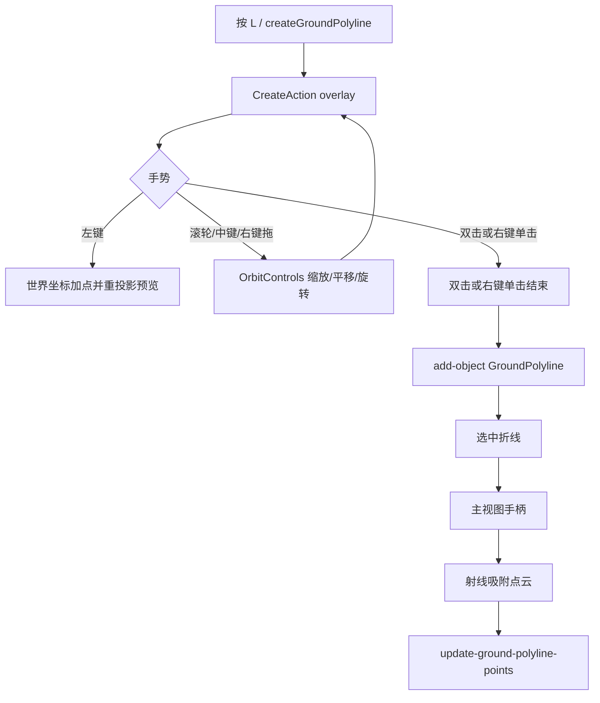

# Curb/wall 主视图缩放与顶点拖动设计

## 背景与目的

标注 curb/wall（`GROUND_POLYLINE`，快捷键 `L`）时，点云范围往往很大。按 `L` 进入画线后，主视图被一层全屏 overlay 挡住，滚轮和拖动到不了 `OrbitControls`，无法缩放或移动点云，边界看不清。画完之后，主视图也不能拖顶点；目前只有三视图有手柄，且创建时点被压到地面 `z`，高度不好改。

本设计让画线过程中仍能操作主视图相机，并在画完后于主视图拖动顶点，吸附激光点以同时修改 X/Y/Z。

## 范围与假设

### 范围内

- 主视图创建 `GROUND_POLYLINE` 时的相机操作（缩放、平移、旋转）
- 选中折线后，主视图顶点手柄与拖动吸附点云
- 仅 `frontend/pc-tool`

### 范围外

- 三视图拖动/缩放（已有滚轮缩放与右键拖动画布，不改）
- 停车位 `GROUND_POLYGON` 创建与主视图编辑
- 图像 2D 投影折线编辑
- 后端同步与按半径裁剪
- 创建阶段把点直接吸附到点云（创建仍落地面 `z`，高度靠画完后拖动修正）

### 已确认决策

| 项 | 选择 |
| --- | --- |
| 方案 | A：画线期间转发相机手势；画完后主视图手柄吸附激光点 |
| 画线左键 | 加点，不变 |
| 画线滚轮 | 缩放点云 |
| 画线右键拖动 | 平移相机 |
| 画线中键拖动 | 旋转相机 |
| 结束画线 | 双击；右键单击（移动小于阈值） |
| 创建时高度 | 仍用地面平面 `z` |
| 主视图拖顶点 | 射线吸附最近激光点，写入该点 XYZ |
| 无点可吸 | 不更新该顶点 |

### 假设

- 主视图仍是透视相机 + `OrbitControls`（左键旋转、右键平移、滚轮缩放、中键缩放/旋转按 three 默认；画线时左键改作加点，旋转改由中键拖动承担）
- 点云在 `pointCloud.groupPoints.children[0]`
- 顶点修改继续走 `update-ground-polyline-points`，可撤销合并
- 吸附用射线到点云的最近点，半径固定为 **0.5 m**

## 相关目录与文件

| 路径 | 作用 |
| --- | --- |
| `frontend/pc-tool/src/packages/pc-render/action/CreateAction.ts` | 画线 overlay；转发相机手势；世界坐标存点并随相机重投影 |
| `frontend/pc-tool/src/packages/pc-render/action/OrbitControlsAction.ts` | 被 overlay 转发的相机控制 |
| `frontend/pc-tool/src/packages/pc-editor/common/ActionManager/action/create.ts` | `createGroundPolyline` 使用已算好的世界坐标 |
| `frontend/pc-tool/src/packages/pc-render/renderView/MainRenderView.ts` | 选中折线后的顶点手柄与拖动吸附 |
| `frontend/pc-tool/src/packages/pc-editor/hack.ts` | 主视图手柄拖动接到 `update-ground-polyline-points` |
| `frontend/pc-tool/src/packages/pc-editor/common/CmdManager/cmd/UpdateGroundPolylinePoints.ts` | 已有命令，不改语义 |

## 核心模块

### CreateAction overlay 与相机

`CreateAction.start` 仍显示全屏 `canvas`。该层继续拦截左键加点，但不再吞掉相机手势。

- `wheel`：`preventDefault` 后转给 `OrbitControls` 所在的 `renderer.domElement`，或直接改 `control` 的 dolly。overlay 存在期间必须能缩放。
- `mousedown` 中键：开始旋转，把后续 `mousemove`/`mouseup` 交给 OrbitControls。
- `mousedown` 右键：记录起点。移动超过 **4 px** 视为拖动平移，交给 OrbitControls，本次不结束画线。移动未超阈值并 `mouseup`/`contextmenu`：结束画线（点数 ≥ 2）。
- 左键 `click`：加点。双击结束逻辑保持现有 250 ms 延迟，避免双击被当成两次加点。

已画点不能只存屏幕坐标。点击时立刻 `canvasToWorld`，`z` 设为 `ground.plane.constant`（与现有 `createGroundPolyline` 一致），存入世界坐标列表。预览绘制用当前相机把世界点投影回 canvas。监听 `RENDER_AFTER` 或 OrbitControls `change`，相机一动就重画，避免缩放后预览线漂在错误位置。

结束回调把**世界坐标点列**交给 `createGroundPolyline`，不再在回调里用过期的屏幕点重算。

### 主视图顶点手柄

选中 `GroundPolyline` 且对象在 `annotate3D` 中时，主视图显示与三视图类似的圆形手柄（HTML overlay，`pointer-events` 仅手柄可点）。相机或折线变化时，用主相机把 `points3D` 投影到 canvas 更新手柄位置。

未选中、选中的不是折线、或折线不可见：隐藏手柄。

拖动手柄：

1. `pointerdown` 选中该顶点，阻止冒泡，避免触发选中其它物体或 OrbitControls 旋转。
2. `pointermove`：从主相机发射线，对点云做 `Raycaster` 相交（`params.Points.threshold` 对应约 0.5 m，或等价的最近点搜索）。
3. 命中则克隆 `points3D`，把该下标换成命中点的世界 XYZ，调用 `onGroundPolylinePointsChange`。
4. 未命中（没有点在 0.5 m 内）：不改点。
5. `pointerup`：结束拖动。命令合并窗口沿用现有 500 ms。

主视图拖动**不做**地面投影，否则 Z 不变，与「XYZ 都要变」冲突。

`hackMainView` 增加与侧视图相同的回调：`editor.cmdManager.execute('update-ground-polyline-points', { object, points })`。

### 三视图

不改。侧视图手柄仍按各自相机平面改坐标。

## 调用流程

## 配置说明

无新配置项、无新环境变量。吸附半径 0.5 m、右键单击判定 4 px 写在代码常量里。

## 输入与输出

| 输入 | 输出 |
| --- | --- |
| 左键点击序列 + 双击/右键单击 | 一条至少 2 点的 `GROUND_POLYLINE`，点在地面 `z` |
| 画线期间滚轮/中键/右键拖 | 仅相机变化，不加点、不结束 |
| 选中折线后拖主视图手柄 | 该顶点变为命中激光点的 XYZ；未命中则保持原值 |

## 错误处理

- 结束时点数 &lt; 2：保持现有提示「地面折线至少需要两个点」，不创建对象。
- 点云未加载或 `groupPoints` 为空：手柄可显示，拖动不更新点。
- 射线未命中：静默保持原顶点，不弹窗。
- 折线点数 &lt; 2 的 `setPoints` 仍抛错；拖动不得把点数减到 2 以下（只改位置，不删点）。

## 验证方法

无独立自动化 UI 测试。改完后在 `pc-tool` 中手工验证：

1. 打开大范围点云，按 `L`，滚轮能放大到看清边界；中键拖动能转视角；右键拖动能平移。
2. 画线过程中缩放后，已画的预览折线仍钉在原世界位置。
3. 左键加点、双击结束，对象创建成功。
4. 右键拖动平移后松开，不结束画线；右键单击（几乎不动）结束画线。
5. 选中折线，主视图出现手柄；拖到路沿点上，该点 X/Y/Z 都变，三视图与主视图一致。
6. 拖到空处（0.5 m 内无点）顶点不动。
7. Ctrl+Z 能撤销顶点拖动。
8. 三视图滚轮缩放、右键拖画布行为与改前相同。

## 常见问题

| 现象 | 原因 | 处理 |
| --- | --- | --- |
| 按 L 后仍不能缩放 | overlay 仍 `stopPropagation` 掉 `wheel` | 画线期间必须把 `wheel` 交给 OrbitControls |
| 缩放后预览线错位 | 仍只存了屏幕坐标 | 点击时存世界坐标，相机变化后重投影 |
| 右键一拖就结束画线 | 平移和结束都绑在右键 | 移动超过 4 px 只平移，单击才结束 |
| 主视图拖点高度不变 | 仍投影到地面 | 必须吸附点云 XYZ |
| 拖动手柄却转了相机 | 手柄事件冒泡到 OrbitControls | `pointerdown` 阻止冒泡 |

## 备注与限制

- 创建阶段点在地面上，斜坡/高路沿要靠画完后拖动手柄贴点云。
- 点云过稀时 0.5 m 内可能吸不到，需要换个更密的位置再拖。
- 主视图手柄是 2D HTML，遮挡关系按屏幕投影，不处理被物体挡住的深度排序。
- 不新增主视图「拖整条折线平移」；本次只拖单个顶点。
