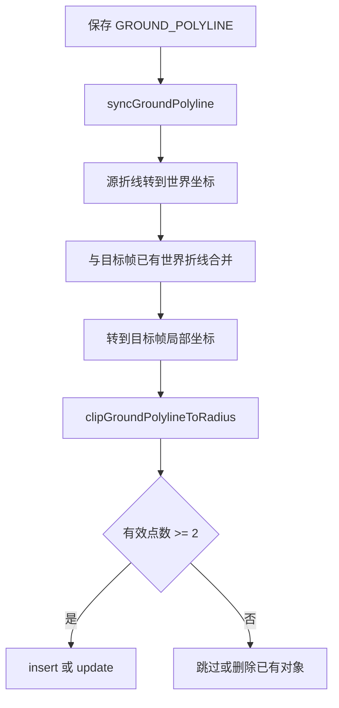

# Curb/wall 同步按半径裁剪设计

## 背景与目的

静态 `GROUND_POLYLINE`（curb/wall）跨帧同步时，当前实现会把源帧整条折线投影到目标帧。只要折线到点云原点的最近距离仍小于 `syncDistance`，整条线都会保留。

实际标注里，一条 curb/wall 往往很长：当前帧只能标点云范围内的一段，圆外虽然物理上还在，但标不了。车开到下一帧后，原先那段可能已经出范围，新进入范围的部分才需要标。同步必须保证**同一地点的几何不变**，并把超出半径的部分裁掉，而不是整条复制或整条删除。

## 范围与假设

### 范围内

- 数据集开启 `syncMode` 后，静态 `GROUND_POLYLINE` 的保存触发同步
- 实现位置：后端 `TrackSyncUseCase.syncGroundPolyline`
- 圆心：目标帧点云原点，即局部坐标 `(0, 0)`
- 半径：该对象的 `syncDistance`
- 圆内多段互不相连时，只保留离原点最近的一段
- 虽为静态物体，折线**长度可以变化**（后续帧接长或改短）

### 范围外

- `GROUND_POLYGON`（停车位）同步逻辑
- 3D 框静态/动态同步
- 前端显示层单独裁剪
- 另存一条完整世界折线作为 canonical 几何
- 把同一 `trackId` 拆成多条折线对象

### 已确认决策

| 项 | 选择 |
| --- | --- |
| 实现路径 | 后端 `syncGroundPolyline` 投影后按圆裁剪 |
| 圆心 | 当前帧点云原点 `(0, 0)` |
| 半径 | 对象 `syncDistance` |
| 多段冲突 | 只保留离原点最近的连续段 |
| 边界 | 线段与圆相交处插入裁剪点 |
| 源帧 | 本帧写入结果同样裁剪；同步计算用保存时的完整源折线，先与其他帧世界折线合并，再按帧裁剪 |
| 长度变化 | 静态只约束重叠处世界位置；长度以各帧世界折线并集为准，源帧覆盖重叠段 |

### 假设

- 保存请求里的源折线先转到世界坐标，再与目标帧已有折线合并，最后变到目标帧局部坐标再裁剪
- 距离与现有同步一致，使用 BEV 平面 `hypot(x, y)`，不把 `z` 计入半径
- 场景帧具备完整位姿，否则该帧跳过（与现有逻辑相同）
- 后续帧把折线接长后再保存：新顶点进入世界并集，能落入某帧圆内的部分会出现在该帧
- 当前帧裁掉的圆外旧段，不得从其他帧删除；那些点仍留在其他帧的几何里，合并时作为翼段保留

## 相关目录与文件

| 路径 | 作用 |
| --- | --- |
| `backend/src/main/java/ai/basic/x1/usecase/TrackSyncUseCase.java` | 同步入口与折线投影；新增圆裁剪并接入 `syncGroundPolyline` |
| `backend/src/test/java/ai/basic/x1/usecase/TrackSyncUseCaseTest.java` | 纯函数单测：投影、距离、裁剪、世界折线合并 |

## 核心行为

保存一条带 `trackId` 的静态 curb/wall 后：

1. 把源帧折线变到世界坐标。
2. 对每个目标帧：取出该帧已有同 track 折线变到世界坐标，与源折线合并（源覆盖重叠段，已有折线在源范围外的翼段保留），再变回该帧局部坐标。
3. 以 `(0, 0)` 为圆心、`syncDistance` 为半径裁剪。
4. 相交处插入圆周上的点，重叠区域内折线形状与源帧一致。
5. 若得到多段互不相连的线，只保留 `distanceToGroundShapeFootprint` 最小的一段。
6. 有效点少于 2 个：该帧不写入；若已有同 track 折线则删除。

因此：车开过之后当前帧会裁掉已经出范围的旧段；下一帧把折线接长再保存时，旧帧里还在其圆内的那段不会被新的短源折线抹掉，新接长的部分会出现在圆能罩住它的帧上。

## 算法

新增纯函数 `clipGroundPolylineToRadius(JSONArray points, double radius)`，返回裁剪后的点列；无有效段时返回空数组。

对相邻点 `P`、`Q`：

- 两端都在圆内（`hypot <= radius`）：整段保留。
- 两端都在圆外：丢弃。若线段穿过圆，保留圆内弦（两个交点）。
- 一端在内一端在外：求与圆的交点，只保留圆内子段。

交点：参数方程 `P + t(Q-P)` 与 `x² + y² = R²`，取 `t ∈ [0, 1]` 的实根。数值上把刚好落在圆周上的点视为圆内。

将相邻圆内子段连成连续折线。对每条连续折线用现有 `distanceToGroundShapeFootprint` 打分，取距离最小的一条。分数相同则取先出现的一段。

合并函数 `mergeWorldPolylinesPreferringSource(existingWorld, sourceWorld)`：

- 已有为空则返回源折线副本。
- 将已有顶点投影到源折线首尾方向；与源折线距离小于 `0.2m` 的点视为重叠，丢弃（源覆盖）。
- 投影参数 `t < 0` 的保留点作前翼，`t > 1` 的作后翼。
- 结果为「前翼 + 源折线 + 后翼」。

`syncGroundPolyline` 中不要再用「最近点仍在半径内则整条保留」，也不要用源折线直接覆盖所有帧。正确顺序是：世界坐标合并 → 变到目标帧 → 按圆裁剪。源帧写入的也是裁剪后的点列。

## 调用流程



## 错误处理

- 源折线点缺失：保持现有 `IllegalArgumentException`。
- 目标帧位姿不完整：跳过该帧，不裁剪、不写入。
- `syncDistance` 非正：沿用现有 `getPositiveDouble` 默认半径。
- 裁剪后空结果：视为该帧不可标注，删除已有同 track 折线。
- 不把裁剪失败吞掉后回退成整条折线。

## 验证方法

在 `TrackSyncUseCaseTest` 中覆盖：

| 用例 | 期望 |
| --- | --- |
| 长直线一半在圆外 | 留下圆内段，外侧端点在圆周上 |
| 整条在圆外且不相交 | 空结果 |
| 整条在圆外但穿过圆 | 留下圆内弦 |
| 穿圆两次 | 只留离原点更近的一段 |
| 顶点在圆内、两边穿出 | 交点–顶点–交点 |
| 两点都在圆内 | 原样保留 |
| 已有前翼 + 更短源折线 | 合并后前翼仍在，重叠段用源 |
| 源折线在一端接长 | 合并结果包含新顶点 |

验证命令（在 `backend` 目录，使用项目 Java 测试方式）：

```bash
cd /PnP/lxzhu/lidar_annos/xtreme/backend
mvn -q -Dtest=TrackSyncUseCaseTest test
```

人工验证：保存一条超出 `syncDistance` 的 curb，切换到前后帧，范围内重叠位置应重合，圆外部分应消失；下一帧把折线接长再保存，当前帧应出现新进入范围的部分，旧的出范围部分应被裁掉。

## 常见问题

| 现象 | 原因 | 处理 |
| --- | --- | --- |
| 下一帧仍看到完整长线 | 仍走旧的 footprint 判断 | 确认部署的是裁剪后的 backend |
| 圆内出现两段 curb | 未做最近段筛选 | 只保留 footprint 距离最小的一段 |
| 端点不在圆周上 | 只删了圆外顶点、未插交点 | 必须插入圆与线段的交点 |
| 源帧自己还有超长尾巴 | 写入前未裁剪 | 各帧写入前都要 `clipGroundPolylineToRadius` |
| 下一帧接长后旧帧开头消失 | 用源折线整条覆盖 | 先世界坐标合并再裁剪 |

## 备注与限制

- 裁剪发生在保存同步之后；未保存前，编辑器里仍可能看到完整折线。
- 新进入范围、任何帧都还没标过的几何，不会被同步「发明」出来，需要在能看见的那一帧接长后再保存。
- 半径只看 XY，高度变化不参与裁剪。
- 静态指位置不变，不指长度冻结。覆盖写只作用于与源折线重叠的世界区段。
